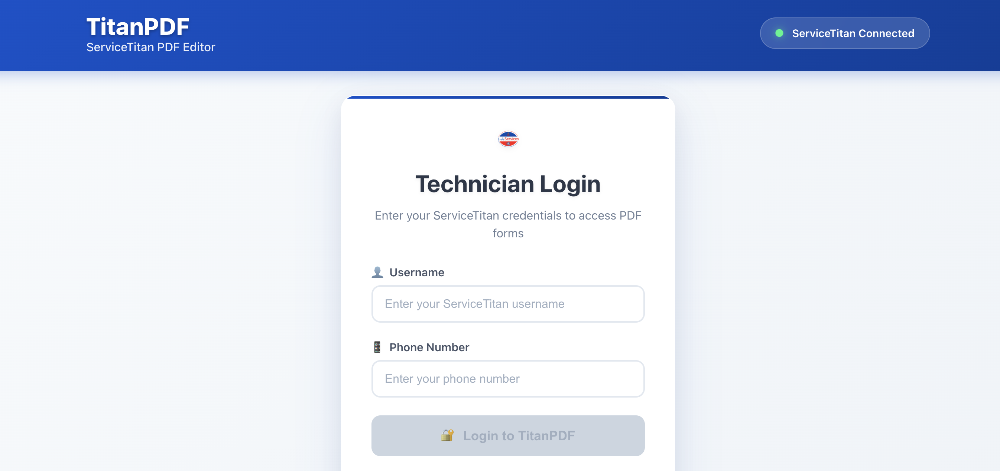

# TitanPDF

  

  <strong>ServiceTitan PDF Editor</strong> 
  Professional PDF form editor with ServiceTitan integration for field technicians

  
  
  

---

## Overview

TitanPDF streamlines PDF form completion for ServiceTitan field technicians. The platform provides interactive form editing with drag-and-drop functionality, signature capture, and seamless integration with ServiceTitan's technician authentication system.

---

## Features

- **ServiceTitan Integration** - Authenticate with existing ServiceTitan credentials
- **Interactive Form Editing** - Fill PDF forms with drag-and-drop fields
- **Signature Capture** - Touch-optimized signature collection
- **Cross-Device Support** - Works on tablets and desktops
- **Remote PDF Loading** - Load forms from local storage or remote URLs
- **Backend API Integration** - Submit completed forms to backend systems

---

## Tech Stack

- **Frontend**: React 18 + TypeScript (Vite)
- **Backend**: Python 3.12 / FastAPI / uvicorn
- **PDF Rendering**: pdfjs-dist
- **PDF Generation**: reportlab + pypdf
- **Authentication**: ServiceTitan OAuth2 (server-to-server)
- **Storage**: Google Drive API v3
- **Deployment**: Docker → Azure Container Apps

---

## Request a Demo

This is a proprietary business solution. For demo access or licensing inquiries:

  

---

## License

Proprietary - All rights reserved. Contact for licensing information.

---

  © 2025 Christian Okeke • TitanPDF

